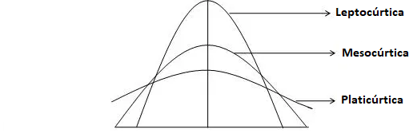

---
output:
    pdf_document:
      latex_engine: xelatex
title: 
    "**Aplicação de ferramentas econométricas em dados do Mercado Financeiro Brasileiro utilizando a linguagem R**"
geometry: margin = 1in
fontsize: 12pt
fig_caption: yes
number_sections: true
indent: true
urlcolor: blue
---

```{r, include = F}
library(knitr)
```

## Introdução

&emsp;&emsp; O objetivo desse artigo é desenvolver uma linha de raciocínio da construção do processo de estimação de um Value-at-Risk a partir de uma volatilidade que varia com o tempo, por meio de uma modelagem ARMA-GARCH e comparar com resultados obtidos em um Value-at-Risk constante no tempo, utilizando dados do Mercado Financeiro Brasileiro, com foco na linguagem de programação R.

## Estacionariedade

&emsp;&emsp; Primeiramente, devemos entender o conceito de estacionariedade, um dos pontos mais importantes ao estimar e fazer inferências em séries temporais. Para fins econométricos, trabalharemos com a estacionariedade fraca, onde temos que um processo estocástico (aleatório) será fracamente estacionário (ou estacionário de segunda ordem), caso sua **(1)** média e sua **(2)** variância forem constantes ao longo do tempo. Além disso, precisamos que a **(3)** covariância não dependa do tempo, mas sim apenas da ordem **_s_** de defasagem (distância temporal entre as observações). Sendo assim, precisamos satisfazer:

\vspace{12pt}

**(1) Média: ** $E(Y_t) = \mu$

**(2) Variância: ** $E[Y_t - E(Y_t)]^2 = \sigma^2$

**(3) Covariância: ** $cov(Y_t, Y_{t-s}) = \gamma_s$

\vspace{12pt}

&emsp;&emsp; Mas por que é tão importante uma série temporal ser estacionária? Pois, caso tivermos uma série temporal não estacionária (média ou variância que variam com o tempo, ou ambas), não poderemos generalizar seu comportamento para outros períodos, somente para o período em consideração. Dessa maneira, caso nossa série for não estacionária, incorreremos no fenômeno de regressão espúria (sem sentido) e com isso não teremos valor prático.

## Base de dados, linguagem R e bibliotecas

&emsp;&emsp; Utilizando-se da linguagem de programação R, com o propósito de efetuar o processo de modelagem, foi escolhida uma amostra de 01/01/2011 até 01/01/2021 da série diária de fechamento ajustada da pontuação do Ibovespa, obtida através do Yahoo Finance.	

```{r, echo = T, error = F, warning = F, message = F}
#carregando as bibliotecas necessárias
library(quantmod)
library(ggplot2)
library(scales)
library(forecast)
library(moments)
library(rugarch)
library(urca)
```

```{r, echo = T, error = F, warning = F, message = F}
#inputs iniciais
ticker <- "^BVSP"
from <- "2011-01-01"
to <- "2021-01-01"

#puxando os dados do Yahoo Finance
price <- na.omit(Ad(getSymbols(ticker,
                               from = from,
                               to = to,
                               auto.assign = F)))

#calculando a diferenciação dos log-retornos
log_ret <- na.omit(diff(log(price)))
names(log_ret) <- "ibov"
```

## Testes informais de estacionariedade

&emsp;&emsp; Como ponto de partida, recorremos para um teste informal, onde simplesmente analisamos o gráfico da nossa série temporal, nos dando assim uma pista acerca da sua provável natureza.

```{r, echo = T, error = F, warning = F, message = F}
#plot da pontuação do Ibovespa
g1 <- ggplot() +
  geom_line(aes(y = price, x = index(price)),
            color = "darkblue", size = 0.5) +
  scale_x_date(date_labels = "%Y", date_breaks = "1 year") +
  scale_y_continuous(labels = number_format(big.mark = ".")) +
  labs(title = "Série diária do Ibovespa",
       x = "Data", 
       y = "Pontos", 
       caption = "Fonte: Yahoo Finance.", 
       color = "") +
  theme_light()
```
\newpage

\begin{center}
\emph{Gráfico 1}
\end{center}

```{r, echo = F, error = F, warning = F, message = F, fig.align = "center", fig.height = 4, fig.width = 10}
g1
```

&emsp;&emsp; Observando o gráfico da pontuação diária do Ibovespa ao longo de dez anos, apesar de não podermos afirmar de antemão com exata certeza se a série é estacionária ou não, ela apresenta algumas características, como subidas e descidas bruscas, aparentando possuir uma tendência linear positiva e com isso evidenciando possível não-estacionariedade. Podemos também constatar a quebra de estrutura causada pela pandemia do Covid-19 a partir de março de 2020, porém essa análise em si foge do escopo desse artigo.

&nbsp; Consideraremos a hipótese de que os preços do mercado de ações seguem um [passeio aleatório com tendência](https://en.wikipedia.org/wiki/Efficient-market_hypothesis), em que cada termo $Y_t$ depende do termo anterior $Y_{t-1}$ somado de um termo de erro $\mu_t$, além de um coeficiente $\beta_2$ que escala a variável temporal $t$ (tendência).

&nbsp; Dessa maneira, partiremos nossa análise mais detalhada a partir da diferenciação \hspace{12pt} $\Delta P_t = P_t - P_{t-1} \rightarrow \Delta log(P_t) = log(P_t) - log(P_{t-1})$ dos log-retornos dos preços (pontuação) de fechamento $P$ no dia $t$ em relação ao dia anterior $t-1$, tendo a série de retorno como $R_t = ln  (\frac{P_t}{P_{t-1}})$. A transformação logarítma suaviza (lineariza) a série, enquanto a diferenciação ajudará a estabilizar a variância da série temporal.

&nbsp; Para termos uma melhor visualização, criamos um gráfico dos dados dos log-retornos dos preços de fechamento ajustados do Ibovespa em que faremos nossos testes e teremos posteriores diagnósticos.

```{r, echo = T, error = F, warning = F, message = F}
#plot da diferenciação dos log-retornos
g2 <- ggplot() +
  geom_line(aes(y = log_ret, x = index(log_ret)),
            color = "darkblue", size = 0.5) +
  scale_x_date(date_labels = "%Y", date_breaks = "1 year") +
  scale_y_continuous(labels = number_format(big.mark = ".")) +
  labs(title = "Série diária do Ibovespa",
       x = "Data", 
       y = "Log-retornos (%)", 
       caption = "Fonte: Yahoo Finance. Elaboração do Autor.") + 
  theme_light()
```

\begin{center}
\emph{Gráfico 2}
\end{center}

```{r, echo = F, error = F, warning = F, message = F, fig.align = "center", fig.height = 4, fig.width = 10}
g2
```

&nbsp; A análise do gráfico com a transformação da primeira diferença dos log-retornos nos permite observar um valor esperado estável em torno de zero $E(R_t) = 0,0002160888$, informando-nos de que a série evolui ao redor da média ao longo do período de dez anos em questão, além dos dados aparentarem apresentar uma menor variabilidade (em relação à série somente da pontuação). Antes de iniciar os testes formais de estacionariedade, precisamos elucidar alguns conceitos importantes.

## Função de Autocorrelação (FAC), Função de Autocorrelação Parcial (FACP)  e Correlograma

&emsp;&emsp; Podemos definir a correlação serial (autocorrelação) como a forma em que uma variável $Y$ qualquer se relaciona com seu passado, isto é, até que ponto o passado dessa varíavel afeta ela no presente. Denotando $Y_t$ como a variável no tempo $t$, então temos que seu coeficiente de autocorrelação $\rho_s$ na defasagem $s$ será igual a:

\vspace{12pt}

$$Y_t = \rho_s Y_{t-s} \rightarrow \rho_s = \frac{\sum{Y_t Y_{t_s}}}{\sum{(Y_{t-s})^2}} \rightarrow \rho_s = \frac{cov(Y_t, Y_{t-s})}{var(Y_t)} $$

\vspace{12pt}

Onde o termo de erro $\mu_t$ é do tipo [ruído branco](https://pt.wikipedia.org/wiki/Ru%C3%ADdo_branco) (média zero, variância constante e i.i.d.) e $-1 \leq \rho \leq 1$. O gráfico em que relaciona o $\rho_s$ com a defasagem $s$ é chamado de Correlograma.

&nbsp; Já o conceito de autocorrelação parcial é análogo ao conceito dos coeficientes em regressão múltipla, onde o coeficiente de autocorrelação parcial $\rho_{ss}$ mede a correlação entre as observações que estão separadas por $s$ períodos, controlando as correlações nas defasagens intermediárias (menores que $s$), removendo seus efeitos.

## Teste de Raíz Unitária (Dickey-Fuller)

&emsp;&emsp; Consideremos o processo estocástico sem constante e sem tendência denotado como $Y_t = \rho Y_{t-1} + \mu_t$, subtraindo $Y_{t-1}$ de ambos os lados, temos $\Delta Y_t = (\rho - 1) Y_{t-1} + \mu_t \rightarrow \Delta Y_t = \delta Y_{t-1} + \mu_t$, em que $\delta = (\rho - 1)$ e $\Delta =$ operador da diferença. Nesse caso, testaremos as seguintes hipóteses:

\vspace{12pt}

$H_0: \delta = 0 \rightarrow \rho - 1 = 0 \rightarrow \rho = 1 \rightarrow$ **raíz unitária (série não estacionária)**

$H_1: \delta < 0 \rightarrow \rho - 1 < 0 \rightarrow | \rho | < 1 \rightarrow$ **raíz não unitária (série estacionária)**

\vspace{12pt}

## Processos Autorregressivos – AR(p)

&emsp;&emsp; É uma extensão do modelo de passeio aleatório, podendo ser incluídos termos mais distantes no passado. Nesse caso, o modelo depende linearmente de termos passados, com coeficientes para cada termo – podemos dizer que é um modelo de regressão em que os termos anteriores são os próprios preditores. Em um modelo autorregressivo de ordem $p$, teremos:

\vspace{12pt}

$$Y_t = \alpha_0 + \alpha_1 Y_{t-1} + \alpha_2 Y_{t-2} + [...] + \alpha_p Y_{t-p} + \mu_t \rightarrow Y_t = \sum{\alpha_p Y_{t-p} + \mu_t} $$
Onde $\mu_t$ é ruído branco.

\vspace{12pt}

&nbsp; Esse modelo nos informa que o valor estimado de $Y_t$ (expressos em torno de seus valores médios) dependerá de seus valores em períodos anteriores (com proporção $\alpha_p$) adicionados de um termo aleatório.

## Processos de Médias Móveis – MA(q)

&emsp;&emsp; É uma combinação linear de termos passados de ruído branco. Matematicamente, em um modelo de médias móveis de ordem $q$, teremos:

\vspace{12pt}

$$Y_t = \mu_t + \theta_1 \mu_{t-1} + [...] + \theta_q \mu_{t-q} \rightarrow Y_t = \sum{\theta_q \mu_{t-q} + \mu_t}$$
Onde $\mu_t$ é ruído branco.

\vspace{12pt}

&nbsp; O processo de média móvel estará sempre associado aos erros do modelo. Além disso, os pesos poderão ser diferentes conforme a importância das observações passadas.

## Processos Autorregressivos de Médias Móveis – ARMA(p, q)

&emsp;&emsp; É a combinação dos dois modelos, em que haverá termos autorregressivos $p$ e termos de média móvel $q$. Em um processo autorregressivo de médias móveis de ordem $p, q$, teremos:

\vspace{12pt}

$$Y_t = \theta + \sum{\alpha_p Y_{t-p}} + \sum{\theta_q \mu_{t-q}} $$

\vspace{12pt}

&nbsp; Já se tivermos que diferenciar a série em d vezes para torná-la estacionária, teremos uma série integrada de ordem $d \rightarrow I(d)$, e então, teremos um processo autoregressivo integrado de médias móveis – ARIMA($p, d, q$).

## Critério de Informação de Akaike (AIC)

&emsp;&emsp; Quando usamos um modelo estatístico para representar o processo que gerou nossos dados, perdemos observações (informações). É aí que o AIC entra ao estimar a quantidade relativa de informação perdida dado certo modelo, logo quanto menos informação um modelo perde, maior é a qualidade desse modelo. Em outras palavras, ele compara diversos modelos, e nos informa aquele que possui melhor qualidade (menor AIC) em relação aos outros. Por definição, temos que o $AIC = 2k - ln \hat{(L)}$, em que:

\vspace{12pt}

$k \rightarrow$ número de parâmetros estimados

$\hat{L} \rightarrow$ valor máximo da [função de máxima verossimilhança](https://en.wikipedia.org/wiki/Likelihood_function)

\vspace{12pt}

&nbsp; Um destaque importante é de que o AIC procura o melhor trade-off entre a qualidade de ajuste (avaliado pela verossimilhança) e penalizando modelos em que mais parâmetros são utilizados.

## A metodologia Box-Jenkins

&emsp;&emsp; O objetivo do método elaborado pelos estatísticos George Box e Gwilym Jenkins é de aplicar modelos ARMA ou ARIMA para encontrar o modelo que melhor se ajuste aos dados passados em séries temporais. Precisamos que as observações sejam estacionárias, para que possamos interpretar e efetuar inferências, a partir de uma base válida. O método consiste em três principais etapas, sendo elas: **(1)** identificação do modelo, **(2)** estimação dos parâmetros do modelo escolhido, e **(3)** verificação do diagnóstico.

&nbsp; **(1) Identificação do modelo**: as principais ferramentas que utilizaremos serão a Função de Autocorrelação (FAC) para estipular a ordem máxima $q$ possível de processos de média móvel, a Função de Autocorrelação Parcial (FACP) para estipular a ordem máxima $p$ possível de processos autorregressivos e seus respectivos Correlogramas resultantes (representações das FAC e FACP contra a extensão da defasagem).

&nbsp; Primeiramente faremos o Teste de Raíz Unitária de Dickey-Fuller sobre nossa série dos log-retornos, para testarmos nossas hipóteses e assegurar que estamos trabalhando com uma série estacionária.

```{r, echo = T, error = F, warning = F, message = F}
#teste de Dickey-Fuller para os log-retornos
ur.df(log_ret, type = "none", lags = 0) #ou utilizar o summary
```

&nbsp; Considerando que como resultado temos o valor da estatística teste igual a $-54,4401$ e para um nível de significância de $\alpha = 5,00$%, temos $-1,95$ como nosso valor crítico, podemos dizer que rejeitamos a hipótese nula de não estacionariedade, uma vez que o valor calculado $<$ valor crítico.

&nbsp; Agora que testamos e sabemos que estamos lidando com uma série estacionária, partimos para a visualização do Correlograma da Função de Autocorrelação (FAC), para estipularmos a ordem máxima $q$ possível de processos de média móvel.

```{r, echo = T, error = F, warning = F, message = F}
#plot da Função de Autocorrelação (FAC)
g3 <- ggAcf(x = log_ret, lag.max = 10) +
  labs(title = "Autocorrelograma dos log-retornos do Ibovespa",
       subtitle = "Intervalo de confiança de 95%",
       y = "Função de Autocorrelação (FAC)", 
       x = "Defasagens") + 
  theme_light()
```
\vspace{12pt}

\begin{center}
\emph{Gráfico 3}
\end{center}

```{r, echo = F, error = F, warning = F, message = F, fig.align = "center", fig.height = 4, fig.width = 10}
g3
```

&nbsp; Podemos observar que possuímos aproximadamente até sete termos $\rho_s$ que ficam de fora do nosso intervalo de confiança de 95% (linha tracejada em azul) e por isso testaremos modelos com termos até _MA(7)_.

&nbsp; Por outro lado, devemos visualizar também o Correlograma da Função de Autocorrelação Parcial (FACP), para determinarmos a ordem máxima $p$ dos nossos termos autorregressivos.

```{r, echo = T, error = F, warning = F, message = F}
#plot da Função de Autocorrelação Parcial (FACP)
g4 <- ggPacf(x = log_ret, lag.max = 10) +
  labs(title = "Autocorrelograma dos log-retornos do Ibovespa",
       subtitle = "Intervalo de confiança de 95%",
       y = "Função de Autocorrelação Parcial (FACP)",
       x = "Defasagens") + 
  theme_light()
```

\begin{center}
\emph{Gráfico 4}
\end{center}

```{r, echo = F, error = F, warning = F, message = F, fig.align = "center", fig.height = 4, fig.width = 10}
g4
```

&nbsp; Como podemos observar, possuímos até cinco termos $\rho_{ss}$ que ficam fora do nosso intervalo de confiança, logo testaremos até um _AR(5)_. Dessa maneira, testaremos todas as combinações possíveis de modelos até um ARIMA($5, d, 7$) e escolheremos o que melhor se ajusta aos nossos dados a partir do Critério de Informação de Akaike (AIC).

```{r, echo = T, error = F, warning = F, message = F}
#encontrando o modelo que se melhor ajusta
best_fit <- auto.arima(log_ret,
                       max.p = 5,
                       max.q = 7,
                       ic = "aic",
                       approximation = F,
                       trace = T)
```

&nbsp; A partir do processo iterativo de checar o melhor modelo entre vários, podemos observar que o modelo com menor perda de informação (menor AIC), portanto o de melhor qualidade é o autorregressivo de médias móveis – ARMA($2,2$) sem constante. Partimos então para a segunda etapa da Metodologia de Box-Jenkins.

&nbsp; **(2) Estimação dos parâmetros do modelo escolhido**: para estimar os coeficientes dos parâmetros, recorreremos para a estimativa por máxima verossimilhança. Considerando que o modelo de maior qualidade é do tipo ARMA($2,2$) sem constante, temos a seguinte equação para nossa série de retornos:

\vspace{12pt}

$$R_t = \alpha_1 R_{t-1} + \alpha_2 R_{t-2} + \theta_1 \mu_{t-1} + \theta_2 \mu_{t-2} + \varepsilon_t $$

Onde $\varepsilon_t$ é ruído branco.

\vspace{12pt}
```{r, echo = T, error = F, warning = F, message = F}
#obtendo os coeficientes estimados do modelo
arima_fitted <- fitted(best_fit)
best_fit$coef
```

&nbsp; A partir dos coeficientes estimados, podemos descrever o processo como sendo um modelo do tipo:

\vspace{12pt}

$$R_t = -1,64 R_{t-1} - 0,82 R_{t-2} + 1,56 \mu_{t-1} + 0,73 \mu_{t-2} + \varepsilon_t $$

\vspace{12pt}

&nbsp; Podemos observar que nossos retornos no tempo $t$, _ceteris paribus_, são negativamente influenciados pelos retornos em $t-1$ e $t-2$ com grandeza $-1,64$ e $-0,82$, respectivamente, e positivamente influenciados por termos aleatórios em $t-1$ e $t-2$ com grandeza $1,56$ e $0,73$, respectivamente.

&nbsp; De forma a visualizar a comparação entre o modelo que estimamos e os valores realizados, elaboraremos um gráfico.

```{r, echo = T, error = F, warning = F, message = F}
#plot dos log-retornos reais vs. estimados pelo modelo
g5 <- ggplot() +
  geom_line(data = log_ret, 
            aes(x = index(log_ret), 
                y = ibov, 
                color = ""), size = 0.5) +
  geom_line(data = arima_fitted, 
            aes(x = index(log_ret), 
                y = arima_fitted,
                color = " "), size = 0.5) + 
  scale_x_date(date_labels = "%Y", date_breaks = "1 year") +
  scale_y_continuous(labels = number_format(big.mark = ".")) +
  scale_color_manual(labels = c("Realizados", "Estimados"), 
                     values = c("darkblue", "gold")) + 
  labs(title = "Log-retornos reais vs. estimados",
       subtitle = "Série diária do Ibovespa",
       x = "Data", 
       y = "Log-retornos (%)", 
       color = "") +
  theme_light() + theme(legend.title = element_blank(), 
                        legend.position = "bottom")
```
\newpage

\begin{center}
\emph{Gráfico 5}
\end{center}

```{r, echo = F, error = F, warning = F, message = F, fig.align = "center", fig.height = 4, fig.width = 10}
g5
```

&nbsp; Por meio de uma análise gráfica, podemos observar que os valores dos parâmetros que estimamos parecem estar ajustados aos nossos dados. Apesar disso, precisaremos efetuar outros testes para obter essa confirmação, partindo assim para a terceira etapa.

&nbsp; **(3) Verificação do diagnóstico**: iremos checar se os resíduos (termos de erro) da equação que estimamos são do tipo ruído branco. Caso tivermos o resultado de que nossos resíduos não são completamente aleatórios, nosso modelo estimado não foi capaz de explicar completamente o comportamento determinístico da nossa série, portanto não seria um bom modelo.

&nbsp; Para fazermos testes formais em relação aos resíduos, podemos usar novamente a Função de Autocorrelação (FAC) e o Teste de Raíz Unitária de Dickey-Fuller. 

```{r, echo = T, error = F, warning = F, message = F}
#resíduos do modelo estimado
resid <- best_fit$residuals
```

```{r, echo = T, error = F, warning = F, message = F}
#FAC dos resíduos do modelo estimado
g6 <- ggAcf(resid, lag.max = 15) +
  labs(title = "Autocorrelograma dos resíduos do modelo estimado",
       subtitle = "Intervalo de confiança de 95%",
       y = "Função de Autocorrelação (FAC)", 
       x = "Defasagens") + 
  theme_light()
```
\newpage

\begin{center}
\emph{Gráfico 6}
\end{center}

```{r, echo = F, error = F, warning = F, message = F, fig.align = "center", fig.height = 4, fig.width = 10}
g6
```

&nbsp; Como os coeficientes de autocorrelação $\rho_s$ estão dentro do nosso intervalo de confiança de 95%, podemos dizer que nosso modelo está bem especificado. Fazendo o teste de Dickey-Fuller, podemos observar em valores estatísticos.

```{r, echo = T, error = F, warning = F, message = F}
#teste de Dickey-Fuller para os os resíduos do modelo estimado
ur.df(resid, type = "none", lags = 0) #ou utilizar o summary
```

&nbsp; Considerando que o resultado que temos para o valor da estatística teste é igual a $-49,3669$ e para um nível de significância de $\alpha = 5,00$%, temos $-1,95$ como nosso valor crítico, podemos dizer que rejeitamos a hipótese nula e portanto nossos resíduos não possuem correlação serial, sendo assim, conseguimos explicar a parte determinística da nossa série de dados temporais com sucesso – de fato nossos resíduos são valores aleatórios do tipo ruído branco.

## Momentos de uma série: assimetria e curtose

&emsp;&emsp; Um fato estilizado que temos em séries temporais de ativos financeiros é a da distribuição de caudas gordas, em que expõe que há a baixa probabilidade de eventos raros ocorrerem, sendo aqueles que se situam nas caudas de uma distribuição Normal (**_risco de cauda_**).

&nbsp; Como os investidores comumente estão mais preocupados com perdas inesperadas do que com ganhos inesperados, as discussões tendem a ser voltadas para a cauda esquerda (perdas). Temos essas condições, pois as decisões tomadas no mercado financeiro dependem de comportamentos humanos (imprevisíveis), em que há evidências de que a distribuição dos retornos ao invés de serem normais, apresentam características de Assimetria (_Skewness_) e Curtose.

&nbsp; A Assimetria (relacionada ao terceiro momento de uma série) é uma medida referente à falta de simetria em determinada distribuição de probabilidade. Considerando que a distribuição Normal possui assimetria zero, conseguimos um indicativo de quanto a distribuição desvia-se da Normal. Em uma **Distribuição Simétrica** (Normal), a média é praticamente igual à mediana. Em uma **Assimetria Negativa** (left-skewed), a mediana é maior que a média e em uma **Assimetria Positiva** (right-skewed), a média é maior que a mediana. A _Figura 1_ descreve muito bem visualmente os três casos citados.

\begin{center}
\emph{Figura 1}
\end{center}

```{r, echo = F, error = F, warning = F, message = F, fig.align = "center", fig.height = 3, fig.width = 7}

```

&nbsp; Já a Curtose (relacionada ao quarto momento de uma série) aborda o achatamento (forma) da curva de distribuição de probabilidade. Uma distribuição com alta Curtose possui um pico mais definido e caudas longas mais gordas, enquanto uma distribuição com baixa Curtose possui um pico mais arredondado e caudas finas menores.

\begin{center}
\emph{Figura 2}
\end{center}

```{r, echo = F, error = F, warning = F, message = F, fig.align = "center", fig.height = 3, fig.width = 7}

```

&nbsp; Se a Curtose = 3, temos uma função **Mesocúrtica** (Normal). Se a Curtose > 3, temos uma função **Leptocúrtica** (de caudas longas). Já se a Curtose < 3, temos a função **Platicúrtica** (mais achatada que a Normal), conforme a _Figura 2_ ilustra.

```{r, echo = T, error = F, warning = F, message = F}
#histograma dos log-retornos
g7 <- ggplot(log_ret, aes(x = log_ret)) + 
  geom_histogram(aes(y =..density..), colour = "black", fill = "darkblue") +
  geom_density(alpha = 0.35, fill = "gold") +
  scale_x_continuous(labels = number_format(big.mark = ".")) +
  labs(title = "Histograma dos log-retornos",
       subtitle = "Série diária do Ibovespa",
       x = "Log-retornos (%)", 
       y = "Frequência") +
  theme_light()
```

\begin{center}
\emph{Gráfico 7}
\end{center}

```{r, echo = F, error = F, warning = F, message = F, fig.align = "center", fig.height = 4, fig.width = 10}
g7
```

&nbsp; Ao nos depararmos com o histograma dos log-retornos, podemos observar em maior detalhe o comportamento da distribuição da nossa série, percebendo que eles seguem uma distribuição muito parecida com a distribuição Normal, porém contendo uma quantidade maior de observações na parte esquerda da cauda.

```{r, echo = T, error = F, warning = F, message = F}
#momentos da série e estatísticas descritivas
skewness(log_ret) #assimetria negativa: moda > mediana > media
kurtosis(log_ret) #leptocurtica (mais alongada)
summary(log_ret)[c(1, 3, 4, 6), 2]
```

&nbsp; Como vimos anteriormente, a média da nossa série dos log-retornos é por volta de zero, com uma alta amplitude, tendo valores compreendidos de aproximadamente $-15,99$% até $13,02$%. A partir do valor de $-0,90$ do coeficiente de _Skewness_, podemos observar também que nossa série possui uma assimetria negativa, evidenciando que a curva de distribuição possui uma cauda mais alongada na esquerda (conforme o histograma nos mostra).

&nbsp; Além disso, pelo fato do coeficiente de Curtose ser maior que 3 (com o valor de $15,46$), temos que a distribuição é do tipo leptocúrtica, isto é, menos achatada do que a curva de distribuição Normal.

## Aglomeração de Volatilidade e o Modelo de Heterocedasticidade Condicional Autoregressiva Generalizada (GARCH)

&emsp;&emsp; Outro fato estilizado conhecido que temos em séries de ativos financeiros é o do fenômeno característico de **_aglomeração por volatilidade_** (onde há períodos em que a volatilidade exibe grandes oscilações, seguidos por períodos relativamente mais estáveis). Em termos gerais, temos que, grandes oscilações tendem a ser seguidas por grandes oscilações e pequenas oscilações tendem a ser seguidas por pequenas oscilações.

&nbsp; Trabalhar com a volatilidade (desvio-padrão dos retornos) dos preços das ações é de interesse dos investidores, uma vez que podemos sugerir que alta volatilidade pode significar grandes lucros/prejuízos, portanto maior incerteza. Além disso, em mercados voláteis, aumenta-se a dificuldade em captar recursos por partes das empresas nos mercados de capitais.

&nbsp; Considerando que estamos utilizando a primeira diferença dos log-retornos do Ibovespa, observamos conforme o _Gráfico 2_, que nossa série frequentemente exibe grandes oscilações (a mais recente sendo na crise do Covid-19 em março de 2020), sugerindo que a variância da série temporal financeira muda ao longo do tempo (heterocedasticidade). Podemos modelar essa variância variante, abordando primeiro o modelo de Heterocedasticidade Condicional Autorregressiva (ARCH), depois generalizando-o, chegando no modelo GARCH.

&nbsp; Denotemos nossos resíduos $\varepsilon_t$ como seguindo um processo estocástico de ruído branco $\mu_t$ (média zero, variância constante e i.i.d.) escalado por um desvio-padrão que depende do tempo $\sigma_t$, temos então $\varepsilon_t = \sigma_t \mu_t$. Como modelaremos o processo da variância como um processo autorregressivo, temos que a variância de hoje é composta pela variância de períodos anteriores ponderada por um coeficiente $\alpha_p$:

\vspace{12pt}

$$\sigma_t^2 = \alpha_0 + \sum{\alpha_p \sigma_{t-p}^2} $$

\vspace{12pt}

&nbsp; Como não conseguimos propriamente observar a $\sigma_t^2$, Engle demonstrou que podemos utilizar a regressão dos resíduos ao quadrado no tempo $t$ em relação aos resíduos ao quadrado dos períodos anteriores como proxy (aproximação) da variância:

\vspace{12pt}

$$\hat{\mu}_t^2 = \hat{\alpha}_0 + \sum{\hat{\alpha}_p \hat{\mu}_{t-p}^2}$$

\vspace{12pt}

&nbsp; Sendo $\hat{\mu}_t^2$ um termo quadrático, quando houver grandes variações nos preços dos ativos financeiros, seu valor será alto e quando $\hat{\mu}_t^2$ for relativamente pequeno, é por causa de variações pequenas.

&nbsp; Generalizando o modelo ARCH($p$), chegamos ao modelo GARCH($p,q$), onde a variância condicional de $\mu_t$ depende não somente dos resíduos quadráticos em períodos anteriores, mas também de sua variância condicional $\sigma_t^2$ de períodos anteriores. Temos então $p$ termos defasados dos resíduos quadráticos e $q$ termos das variâncias condicionais defasadas:

\vspace{12pt}

$$\sigma_t^2 = \alpha_0 + \sum{\alpha_p \mu_{t-1}^2} + \sum{\beta_q \sigma_{t-1}^2} $$

\vspace{12pt}

&nbsp; Note que $\sigma_t^2$ é determinístico, uma vez que depende de valores passados e já conhecidos. Sendo assim, temos que os modelos do tipo GARCH($p,q$) não são estocásticos, apesar de $\varepsilon_t^2$ ser.

```{r, echo = T, error = F, warning = F, message = F}
#elevando os resíduos ao quadrado
resid_quad <- resid^2
```

```{r, echo = T, error = F, warning = F, message = F}
#FAC dos resíduos ao quadrado
g8 <- ggAcf(resid_quad, lag.max = 15) +
  labs(title = "Autocorrelograma dos resíduos a quadrado",
       subtitle = "Intervalo de confiança de 95%",
       y = "Função de Autocorrelação (FAC)", 
       x = "Defasagens") + 
  theme_light()
```
\newpage

\begin{center}
\emph{Gráfico 8}
\end{center}

```{r, echo = F, error = F, warning = F, message = F, fig.align = "center", fig.height = 4, fig.width = 10}
g8
```

&nbsp; A partir da FAC e a FACP dos resíduos quadráticos do nosso modelo estimado, podemos verificar se os termos de ruído branco são dependentes e podem ser previstos. Caso os resíduos forem do tipo ruído branco estrito, serão independentes de média zero e normalmente distribuídos. Dessa forma, os coeficientes de autocorrelação no Correlograma da FAC e FACP dos resíduos quadráticos estarão dentro dos intervalos de confiança de 95% tracejados em azul.

```{r, echo = T, error = F, warning = F, message = F}
#FACP dos resíduos ao quadrado
g9 <- ggPacf(resid_quad, lag.max = 15) +
  labs(title = "Autocorrelograma dos resíduos a quadrado",
       subtitle = "Intervalo de confiança de 95%",
       y = "Função de Autocorrelação Parcial (FACP)", 
       x = "Defasagens") + 
  theme_light()
```
\newpage

\begin{center}
\emph{Gráfico 9}
\end{center}

```{r, echo = F, error = F, warning = F, message = F, fig.align = "center", fig.height = 4, fig.width = 10}
g9
```

&nbsp; O que observamos na realidade, é que na FAC, os coeficientes de autocorrelação vão decaindo lentamente a cada nível de defasagem, enquanto que na FACP temos uma maior estabilização dos coeficientes de autocorrelação parcial a partir da sétima defasagem. Portanto, os resíduos quadráticos nos dão indícios de serem correlacionados, e com isso temos evidência de efeitos GARCH($p,q$) que podem ser modelados.

&nbsp; Primeiro, precisaremos especificar nosso modelo, em que de forma a simplificar nosso estudo, usaremos um GARCH($1,1$) em conjunto com o ARMA($2,2$) que estimamos. Além disso, de forma a captar melhor os efeitos de Assimetria e Curtose vistos anteriormente, utilizaremos a distribuição [t-Student](https://pt.wikipedia.org/wiki/Distribui%C3%A7%C3%A3o_t_de_Student) ao invés da Normal.

```{r, echo = T, error = F, warning = F, message = F}
#especificando o modelo
t_garch_spec <- ugarchspec(
  variance.model = list(model = "sGARCH", garchOrder = c(1,1)),
  mean.model = list(armaOrder = c(2,2), include.mean = T),
  distribution.model = "std"
  )
```

&nbsp; Após especificarmos nosso modelo, estimamos os valores ajustados para nossa série de variância e podemos observar parte dela em conjunto com a série dos log-retornos e dos erros do modelo.

```{r, echo = T, error = F, warning = F, message = F}
#encontrando os valores estimados do modelo ARMA(2,2)-GARCH(1,1)
fit_t_garch <- ugarchfit(spec = t_garch_spec,
                         data = log_ret)

#salvando os valores estimados
fitted_t_garch_series <- cbind(log_ret, 
                               fit_t_garch@fit$sigma,
                               fit_t_garch@fit$z)
names(fitted_t_garch_series) <- c("logret", "sigma", "et")

#dez primeiros valores 
head(fitted_t_garch_series, 10)

#dez últimos valores
tail(fitted_t_garch_series, 10)
```

## Value-at-Risk (VaR): abordagem delta-Normal vs. abordagem GARCH

&emsp;&emsp; O Value-at-Risk é uma medida estatística de se medir o risco de perda em determinados ativos ou portfólios. De maneira geral, dado determinado nível de significância $\alpha$ (ou um nível de confiança $1- \alpha$) e um horizonte de tempo (dias, semanas, meses etc.), podemos dizer que a perda máxima não excederá a nossa estimação do VaR para o período em questão. O nível de confiança serve para determinar o grau de certeza em relação a medição (níveis de confiança mais elevados implicam em perdas mais elevadas), enquanto o horizonte temporal nos informa o intervalo que estamos avaliando (sendo que quanto maior for esse horizonte, maior tenderá a ser a perda estimada).

&nbsp; Para nosso estudo, compararemos: **(i)** a abordagem delta-Normal e **(ii)** a abordagem GARCH. A primeira delas considera que os retornos seguem uma distribuição Normal, constante ao longo do tempo, sendo definida por:

\vspace{12pt}

$$VaR_{(1 - \alpha)} = \mu + \sigma N^{-1}_{(1- \alpha)}$$

\vspace{12pt}

&nbsp; Em que $1- \alpha$ é o nível de confiança estabelecido; $\mu$ é a média dos retornos; $\sigma$ é o desvio-padrão dos retornos; e $N^{-1}_{(1- \alpha)}$ é a inversa da Função de Densidade de Probabilidade (FDP), que nos gerará o quantil correspondente da distribuição Normal.

&nbsp; Já a segunda, que é o nosso foco, considera que a volatilidade varia conforme o tempo passa (fenômeno da aglomeração por volatilidade), usando da variância condicional dada pelo modelo GARCH($1,1$) que estimamos. Dessa maneira, temos:

\vspace{12pt}

$$VaR_{(1 - \alpha)} = \mu + \hat{\sigma}_{t | t - 1} T^{-1}_{(1- \alpha)}$$

\vspace{12pt}

&nbsp; Em que $\hat{\sigma}_{t | t - 1}$ é o desvio-padrão condicional em $t$, considerando o último dado em $t-1$; e a $T^{-1}_{(1- \alpha)}$ é a inversa da Função de Densidade de Probabilidade (FDP), que nos gerará o quantil correspondente da distribuição _t-Student_.

&nbsp; É importante destacar que uma perda que exceda o limite estabelecido pelo VaR, dado determinado nível de significância, não é capturada, sendo assim não nos informando acerca da magnitude da perda, acarretando em uma "brecha" no VaR. Apesar dessa e outras falhas ([maiores detalhes sobre VaR](http://clubedefinancas.com.br/materias/valor-em-risco/)), é uma medida amplamente utilizada na quantificação de risco no mercado financeiro, devido - a não só - a sua facilidade de implementação em _backtestings_.

&nbsp; O backtesting é uma ferramenta que viabiliza a verificação da consistência e comparação entre as perdas realizadas e as perdas estimadas pelo modelo, nos informando como ele se comporta, por meio da utilização de dados históricos. Esse processo, nos ajuda a reduzir a sub-estimação do VaR, dando maior segurança para instituições que necessitem de capital para arcar com eventuais perdas. Além disso, também ajuda a reduzir a sobre-estimação, fazendo com que instituições não tenham que ser estritamente conservadoras, segurando mais capital que o necessário, possibilitando assim uma maior flexibilidade.

&nbsp; Primeiramente dividiremos nossa amostra em duas, onde utilizaremos as observações $1$ até $1575$ como teste e validaremos seu comportamento nas $895$ observações restantes ($1576$ até $2470$). 

```{r, echo = T, error = F, warning = F, message = F}
#observações teste e validação
set <- length(log_ret["2011-01-04/2017-05-17"])

test <- 1:set #observações 1:1575
validation <- (set+1):nrow(log_ret) #observações 1576:2470
```

&nbsp; Depois disso, faremos o backtesting com o modelo que havíamos especificado anteriormente, possibilitando a obtenção dos parâmetros da distribuição, necessários para a previsão de nossos valores hipotéticos. Iremos re-estimar o modelo a cada nova observação e utilizaremos um nível de significância de $\alpha = 5,00$%.

```{r, echo = T, error = F, warning = F, message = F}
#backtesting
roll_garch <- ugarchroll(
  spec = t_garch_spec, #modelo especificado
  data = log_ret,
  n.ahead = 1,
  forecast.length = 1, #a partir dos dados de validação
  n.start = set,
  refit.every = 1, #re-estimando o modelo a cada nova observação
  refit.window = "recursive",
  calculate.VaR = T,
  VaR.alpha = 0.05, #nível de significância de 5%
  keep.coef = T
  )

#forma da distribuição da série
shape <- fitdist(distribution = "std", x = log_ret)$pars[3]
t_dist_quantile <- qdist(distribution = "std", shape = shape , p = 0.05)

#valores previstos
validation_VaR <- mean(log_ret[validation]) +
  roll_garch@forecast$density$Sigma * t_dist_quantile
```

&nbsp; Com o backtesting feito, podemos elaborar um gráfico de forma a visualizar o Value-at-Risk com a abordagem GARCH em comparação com o Value-at-Risk com a abordagem delta-Normal.

```{r, echo = T, error = F, warning = F, message = F}
#plot do VaR delta-Normal, VaR GARCH e retornos
g10 <- ggplot() +
  geom_line(aes(y = validation_VaR, 
                x = index(log_ret[validation]), 
                color = ""), size = 0.5) +
  geom_point(aes(y = log_ret[validation],
                 x = index(log_ret[validation]),
                 color = as.factor(log_ret[validation] < validation_VaR)), 
             size = 1.5) +
  geom_hline(aes(yintercept = sd(log_ret) * qnorm(0.05), color = " "),
             size = 0.5) +
  scale_y_continuous(labels = scales::number_format(accuracy = 0.01,
                                                    decimal.mark = '.'),
                     expand = expansion(c(-0.01, 0.01))) +
  scale_color_manual(labels = c("VaR GARCH", "VaR delta-Normal", "Retornos", 
                                "Retornos < VaR GARCH"),
                     values = c("darkcyan", "gold", "gray", 
                                "darkblue")) + 
  labs(title = "VaR GARCH(1,1) vs. VaR delta-Normal",
       y = "%", 
       x = element_blank(), 
       color = "") + 
       theme_light() + theme(legend.position = "bottom")
```

\begin{center}
\emph{Gráfico 10}
\end{center}

```{r, echo = F, error = F, warning = F, message = F, fig.align = "center", fig.height = 4, fig.width = 10}
g10
```

&nbsp; A partir de uma análise gráfica, podemos perceber que temos algumas observações (pontos em azul) que são menores que o VaR estimado pela abordagem GARCH (linha em verde ciano), porém que são maiores que aquelas estimadas pelo VaR delta-Normal (linha em amarelo). Além do gráfico, de forma a suportar nossa análise, podemos calcular o número de vezes cada um dos modelos excede em quantificar o risco.

```{r, echo = T, error = F, warning = F, message = F}
#resumo de exceções
excecoes_dn <- sum(
  log_ret[validation] < 
    (mean(log_ret) + qnorm(0.05) * sd(log_ret[validation])))
excecoes_garch <- sum(log_ret[validation] < validation_VaR)
melhor_abordagem <- if(
  excecoes_dn < excecoes_garch){"ARMA-GARCH"} else{"delta-Normal"}

cat(" Número de excedências com a abordagem delta-Normal:", excecoes_dn,
    "\n",
     "Número de excedências com a abordagem ARMA-GARCH:", excecoes_garch,
    "\n",
     "A abordagem", melhor_abordagem,
    "consegue captar melhor os valores excedentes!")
```

&nbsp; Dessa forma, temos que o VaR constante sobre-estima o risco, enquanto que o VaR com variância condicional aparenta se adequar melhor, possibilitando a captura de maiores retornos, sendo uma ferramenta de predição mais efetiva em nosso estudo.

```{r, echo = T, error = F, warning = F, message = F}
#última etapa: previsão
garch_prev <- ugarchforecast(fit_t_garch, n.ahead = 3)

VaR_t1 <- round(
  (t_dist_quantile * garch_prev@forecast$sigmaFor[1]) * 100, 4)
VaR_t2 <- round(
  (t_dist_quantile * garch_prev@forecast$sigmaFor[2]) * 100, 4)
VaR_t3 <- round(
  (t_dist_quantile * garch_prev@forecast$sigmaFor[3]) * 100, 4)
VaR_dn <- round((sd(log_ret) * qnorm(0.05)* 100), 4)

cat(" VaR delta-Normal é: ", VaR_dn, "%.", "\n",
    "VaR-GARCH em t+1 é: ", VaR_t1, "%.", "\n",
    "VaR-GARCH em t+2 é: ", VaR_t2, "%.", "\n",
    "VaR-GARCH em t+3 é: ", VaR_t3, "%.")
```

&nbsp; Por fim, para concluirmos, estimamos os valores previstos em três dias a frente, nos dando uma ideia de quanto as instituições poderiam flexibilizar em sua tomada de risco em busca de maiores retornos no mercado financeiro em relação a uma medida fixa, mais rígida, que seria o VaR delta-Normal.

\newpage

## Referências

- GUJARATI, D. N.; PORTER, D. C. “Econometria Básica”, 5. ed. Bookman: Porto Alegre, 2011.

- BUENO, Rodrigo De Losso da Silveira. “Econometria de Séries Temporais”, 2. ed., 2012.

- Engle, Robert. "GARCH 101: The Use of ARCH/GARCH Models in Applied Econometrics". Journal of Economic Perspectives — Vol. 15, No. 4, pp. 157–168, 2001.

- Christoph Hanck, Martin Arnold, Alexander Gerber, Martin Schmelzer. "Introduction to Econometrics with R", 2020. https://www.econometrics-with-r.org/

- Alexios Ghalanos (2020). rugarch: Univariate GARCH models. R package version 1.4-4. https://cran.r-project.org/web/packages/rugarch/vignettes/Introduction_to_the_rugarch_package.pdf

- Angelidis, Timotheos and Benos, Alexandros and Degiannakis, Stavros. "The Use of GARCH Models in VaR Estimation". Published in: Statistical Methodology — Vol. 2, No. 1, pp. 105-128, 2004.